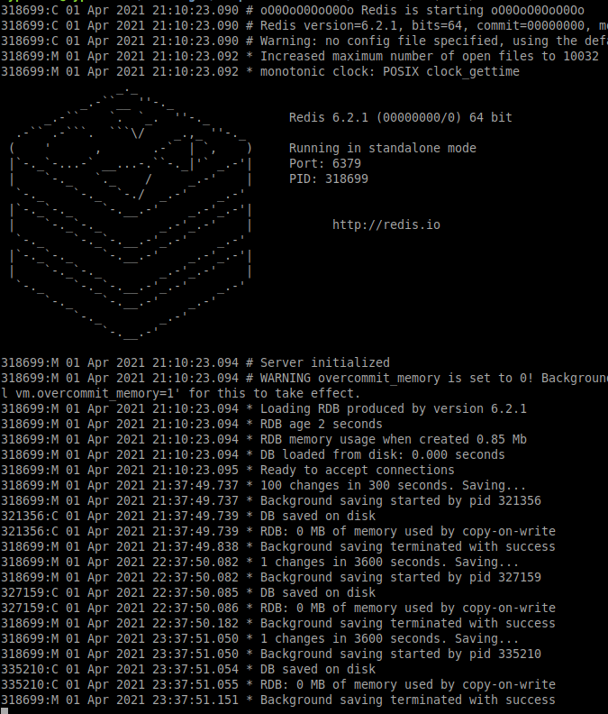
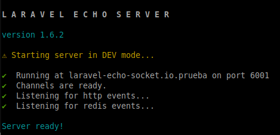
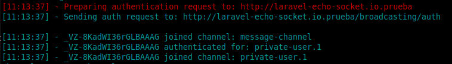
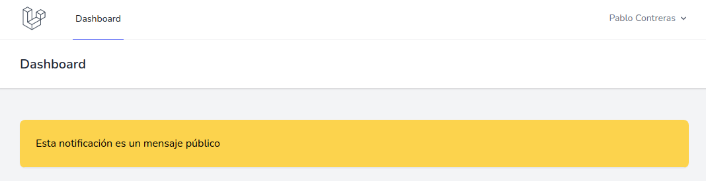
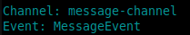
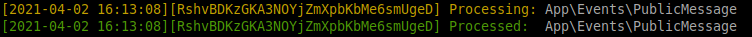
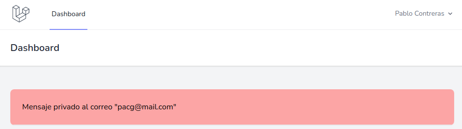
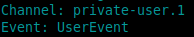
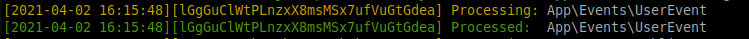
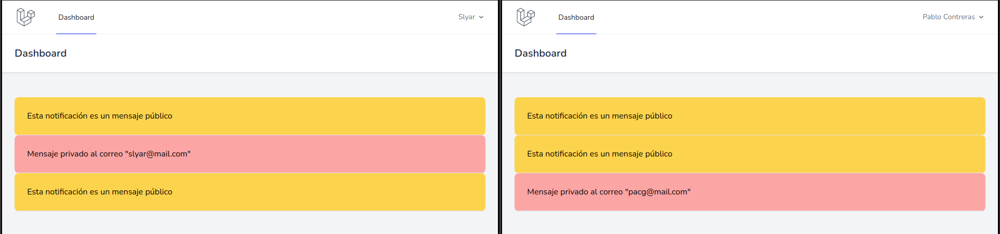

# laravel-echo-socket.io
**Un proyecto para testing y config de tu servicio de socket.io con laravel**

##### **Probado con**:

* ubuntu 20.04
* php 8.0.3
* node 14.16.0
* npm 7.7.5
* redis 6.2.1

Crear el archivo '.env'
Copiar el contenido del archivo '.env.example' en el archivo anteriormente creado

Indicar la URL del proyecto en la propiedad 'APP_URL'

Crear la base de datos llamada, en nuestro caso, 'laravel_echo_socket_io'

NOTA: no saltarse los pasos anteriores o el siguiente comando dará error

El siguiente comando ejecutará un script que instalará todos los archivos necesarios

    composer run-script install

Registrar usuarios en la URL '/register'

Esto nos redirigá a la URL '/dashboard' si quiere registrar otro usuario, desloguear y dirigirse a la pantalla '/register' nuevamente

En el archivo 'laravel-echo-server.json' (en la raiz), modificar el archivo y cambiar la propiedad "authHost" y "host" a la URL de su proyecto

Instalar laravel echo de manera global con el siguiente comando:

    sudo npm install -g laravel-echo-server

Para ejecutar redis hay 2 maneras (que yo conozco), dentro de la carpeta '/redis' encontraran el archivo 'redis-6.2.1.tar.gz'
Descomprimirlo con el siguiente comando:

    tar xzf redis-6.2.1.tar.gz

Entrar al directorio:

    cd redis-6.2.1

Ejecutar lo siguiente:

    make

Para levantar el servicio ejecutar:
    
    src/redis-server

Nos aparecera en la consola algo como lo siguiente:

Si genera algun error solo debe buscar liberar el puerto o cambiarlo en la configuracion.

Puede interactuar con Redis utilizando el cliente integrado:
    
    src/redis-cli
    redis> set foo bar
    OK
    redis> get foo
    "bar"

Del PPA oficial de Ubuntu

Puede instalar la última versión estable de Redis desde el repositorio de paquetes redislabs/redis. Agregue el repositorio al índice de apt, actualícelo e instale:

    sudo add-apt-repository ppa:redislabs/redis
    sudo apt-get update
    sudo apt-get install redis

Esto deberia de levantar un servicio de redis automaticamente

Para ejecutar el proyecto debemos ejecutar levantar 2 consolas:

1 - Iniciar el servicio conectando con redis:

    laravel-echo-server start

2 - Ejecutar las tareas que escuchen los eventos:

    php artisan queue:work

Si todo esta bien deberiamos poder entrar al '/dashboard' (despues de haber logueado) y la consola del 'laravel-echo-server start' mostrarnos algo como lo siguiente:

Abrir 2 pestañas mas:

Una en '/public-message' nos mostrara un msj como lo siguiente:

    Mensaje publico

Esto enviara el siguiente msj al dashboard:

 

En la console de 'laravel-echo-server start' mostrarnos algo como lo siguiente:

Y en la consola de 'queue:work' algo como lo siguiente:

Y otra en '/user-channel' nos mostrara un msj como lo siguiente:

    Mensaje privado al usuario + concatenado el correo del usuario logueado

Esto enviara el siguiente msj al dashboard:

    'Mensaje privado al correo '

Como por ejemplo: 

 

En la console de 'laravel-echo-server start' mostrarnos algo como lo siguiente:

Y en la consola de 'queue:work' algo como lo siguiente:

Si logueamos con 2 usuarios y ejecutamos los eventos, deberiamos ver un resultado como el siguiente:

[Tutorial para hacer este README.md](https://guides.github.com/features/mastering-markdown/)